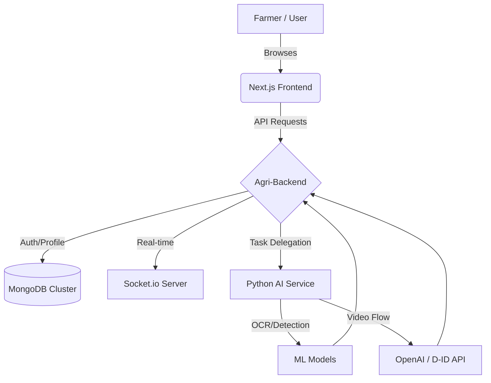

<div align="center">

# 🌱 AgriPredict360
### *Empowering the Future of Farming with AI and 3D Visuals*

[](https://nextjs.org/)
[](https://fastapi.tiangolo.com/)
[](https://nodejs.org/)
[](https://www.mongodb.com/)
[](https://render.com/)

---

**AgriPredict360** is a comprehensive agricultural ecosystem designed to bridge the gap between traditional farming and modern AI. Featuring a **premium 3D interface**, **intelligent disease detection**, and **automated multilingual educational content**, it's built to empower farmers worldwide.

[Explore Demo](#-screenshots) • [Installation](#-getting-started) • [API Docs](docs/API.md)

</div>

---

## 🚀 Key Features

### 🧠 **AI-Powered Diagnostics**
*   **Disease Detection:** Upload images of affected crops and get instant diagnosis with high accuracy.
*   **Soil Analysis OCR:** Scan physical soil reports to get automated parameter extraction and nutrient recommendations.
*   **Yield Prediction:** ML-driven revenue forecasting based on soil type, weather, and farm size.

### 🎥 **Multilingual AI Content**
*   **Video Generation:** Automated pipeline (OpenAI + ElevenLabs + D-ID) that creates educational videos for treatment in **Hindi, Punjabi, Marathi, and English**.
*   **Smart Advisories:** Dynamic content generation tailored to current agricultural trends.

### 🌐 **Interactive Ecosystem**
*   **Expert Consultation:** Premium glassmorphism UI for real-time chat and video consultation with verified agronomists.
*   **Gamified Profiles:** Leveling system for farmers, earning badges for disease detections and community contributions.
*   **Knowledge Forum:** Multi-category community forum with "Expert Verified" badges for trusted solutions.

### 🎨 **Next-Gen UX/UI**
*   **3D Interactive Backgrounds:** Parallax effects with falling agricultural icons.
*   **Glassmorphism Design:** Modern, translucent UI components across the entire platform.
*   **Fluid Transitions:** Framer Motion-powered page transitions for a seamless experience.

---

## 🛠️ Tech Stack

| Frontend | Backend | AI Service | Database & Infrastructure |
| :-- | :-- | :-- | :-- |
| **Next.js** | **Node.js** | **FastAPI** | **MongoDB** (Cloud Atlas) |
| **Tailwind CSS** | **Express.js** | **PyTesseract** | **Redis** (Caching) |
| **Framer Motion** | **Socket.io** | **OpenAI / D-ID** | **Render** (Cloud Hosting) |
| **Chart.js** | **JWT Auth** | **Scikit-Learn** | **Docker** (Containerization) |

---

## 🏗️ System Architecture



---

## 🏁 Getting Started

### 1. Clone the repository
```bash
git clone https://github.com/VISHAL-SAHU-KUMAR/CodeZen-2.0.git
cd CodeZen-2.0
```

### 2. Setup Services
**Backend:**
```bash
cd backend
npm install
# Create .env and add MONGO_URI, JWT_SECRET
npm run dev
```

**Frontend:**
```bash
cd frontend
npm install
npm run dev
```

**AI Service:**
```bash
cd ai-service
pip install -r requirements.txt
python main.py
```

---

## ☁️ Deployment (One-Click)

This project is configured for seamless deployment on **Render** via its Blueprint feature.

1.  Push code to GitHub.
2.  Connect repository to **Render Dashboard**.
3.  Apply `render.yaml` blueprint.
4.  Configure `MONGO_URI` and `OPENAI_API_KEY` in Render environment variables.

---

## 📸 Screenshots

<div align="center">
  
  <p><i>The Premium 3D Interactive Dashboard</i></p>
</div>

---

<div align="center">
  Developed with ❤️ for the Global Farming Community. <br/>
  <b>AgriPredict360 - Smart Farming, Better Living.</b>
</div>
